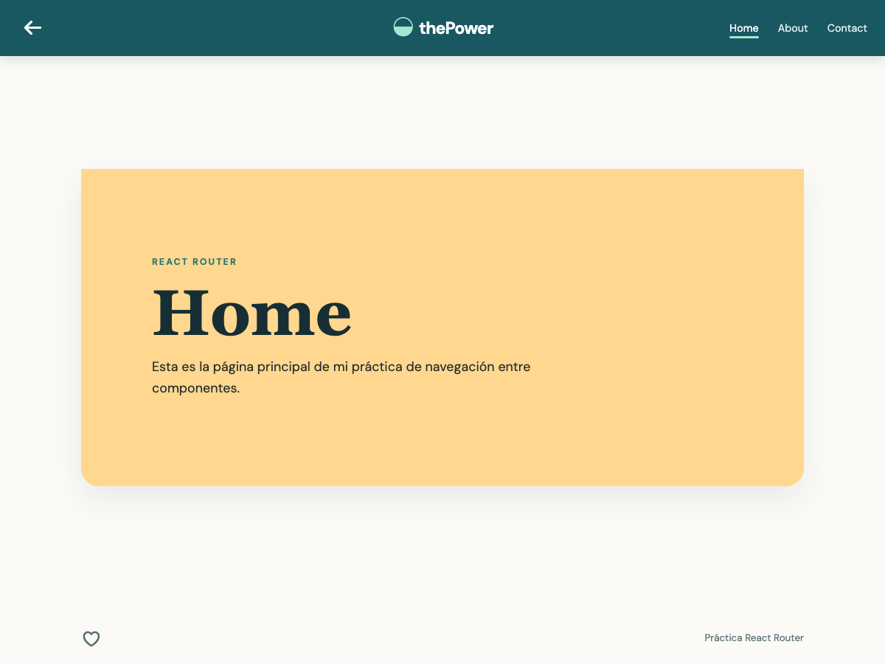
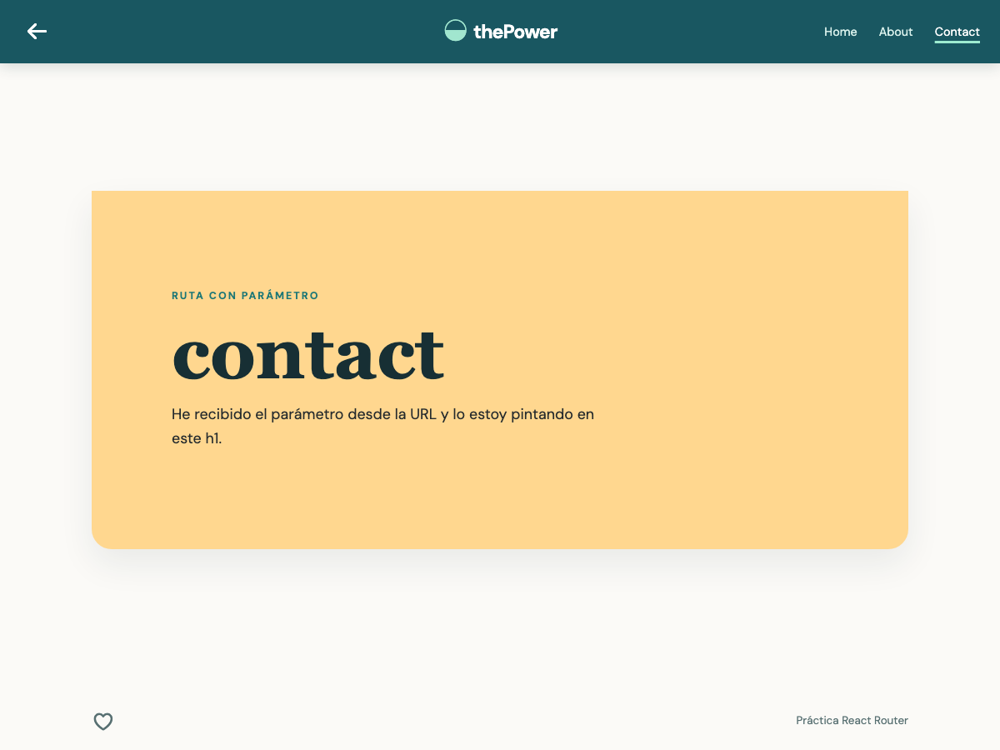
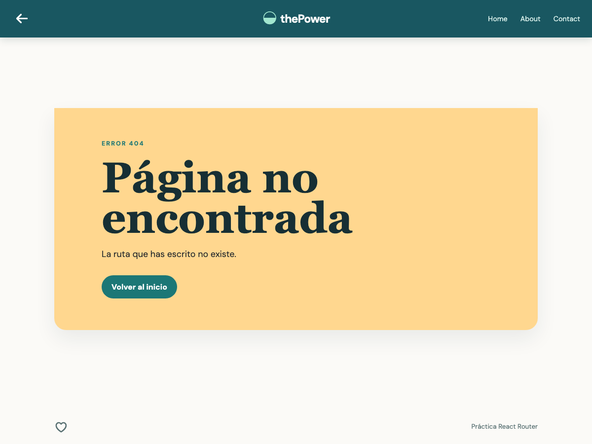

# Memoria del proyecto · React Router

## 1. Resumen

En esta práctica he trabajado la navegación básica en React usando `react-router-dom`. He separado cada pantalla en un componente, he creado un `Header` común para moverme entre ellas y he añadido tanto una ruta dinámica como una respuesta para las rutas que no existen.

## 2. Enunciado y requisitos

Según las capturas del enunciado:

1. Crear un proyecto React e instalar `react-router-dom`.
2. Crear tres componentes dentro de `src/pages`.
3. Declarar una ruta para cada componente.
4. Crear un componente `Header` con la navegación de la página.
5. Enviar un parámetro en una de las rutas y utilizarlo en el componente para pintarlo en un `h1`.
6. Crear un componente `NotFound` para mostrar un mensaje cuando se accede a una ruta no existente.
7. Añadir estilos visibles a cada componente para comprobar mejor el cambio de ruta.

## 3. Cómo lo he resuelto

- En `App.jsx` he declarado las rutas con `Routes` y `Route`.
- He creado `Home`, `About` y `Contact` como componentes independientes.
- `Header` utiliza `NavLink` para marcar la ruta activa y `Link` para volver al inicio. También tiene un botón para retroceder en el historial del navegador.
- La ruta `/contact/:title` utiliza `useParams` dentro de `Contact`. Cuando entro en `/contact/contact`, el valor recibido se pinta en el `h1` como `contact`.
- La ruta comodín `*` carga `NotFound` y ofrece un enlace para volver al inicio.
- He mantenido `InstruccionesEjercicio` fuera del repositorio mediante `.gitignore`, porque contiene las capturas del enunciado.

## 4. Estructura final

```text
src/
  App.jsx
  App.css
  components/
    Header/Header.jsx
    Header/Header.css
  pages/
    Home/Home.jsx
    Home/Home.css
    About/About.jsx
    About/About.css
    Contact/Contact.jsx
    Contact/Contact.css
    NotFound/NotFound.jsx
    NotFound/NotFound.css
  main.jsx
  index.css
```

## 5. Capturas

Página inicial con la ruta `Home` activa:



Ruta dinámica con el parámetro `contact` pintado en el `h1`:



Respuesta de la aplicación al visitar una ruta inexistente:



## 6. Validación

- `npm run build`: compila sin errores.
- `npm run lint`: termina sin avisos.
- Comprobación manual en navegador: funcionan Home, About, Contact, la ruta `/contact/contact` y el componente `NotFound`.
- He revisado la apariencia en una ventana de escritorio y he mantenido los estilos en CSS plano para evitar problemas de compatibilidad con Safari.

## 7. Tecnologías

React 19, Vite y React Router DOM 7.

## 8. Autora

**Araceli Fradejas Muñoz** · Proyecto académico del máster Rock The Code de [The Power Tech School](https://thepower.education/thepowermba/tech).
